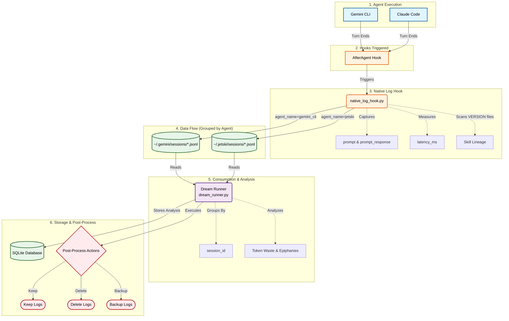

# 🌙 Gemini Nightly Dream System

[](https://github.com/astral-sh/uv)
[](https://www.python.org/downloads/)

> **Transforming yesterday's logs into today's epiphanies.**

A schedulable, self-aware evaluation and improvement system for your Gemini CLI agents and skills. It analyzes your interactions, enforces testing, and provides a dashboard to track your agent's evolution.

---

## 🏗️ Architecture & Data Flow (The Hook System)

The Gemini Dreams system utilizes native CLI hooks to automate the collection and analysis of your agent's interactions. This replaces manual piping and ensures comprehensive data capture with minimal overhead.

### 🔄 System Flow Diagram



### 💡 Detailed Flow Description

1. **Agent Execution**: Interactions begin with the user utilizing an AI assistant like **Gemini CLI** or **Claude Code**.
2. **Hooks**: Once the AI agent completes a conversational turn (or a tool execution cycle), an `AfterAgent` hook is systematically fired.
3. **Native Log Hook**: The interceptor script `native_log_hook.py` is invoked by the hook. This script dynamically pulls context about the turn:
   * **Payload Extraction**: It captures the raw `prompt` and the model's `prompt_response`.
   * **Performance Metrics**: It computes and logs the exact turn `latency_ms`.
   * **Skill Lineage**: It intelligently scans the local environment's `VERSION` files (like the `dream-analyzer/VERSION` skill) to trace which tool iterations the agent had access to during execution.
4. **Data Flow**: Based on the context gathered, the hook groups the interaction by `agent_name`. It then serializes this structured data and appends it to localized `.jsonl` files (e.g., inside `~/.gemini/sessions/` or `~/.jetski/sessions/`).
5. **Consumption**: The `Dream Runner` (`dream_runner.py`) acts as the background orchestrator. It sweeps these directories to ingest the raw JSONL logs, groups the disparate interactions by their common `session_id`, and runs analytical routines to map out critical patterns—such as identifying **token waste** (inefficient loops) and **epiphanies** (successful strategy breakthroughs).
6. **Post-Process Action**: Finally, the processed insights are committed to a local **SQLite database** for historical querying. Depending on predefined configurations or the analysis results, `dream_runner.py` executes a final lifecycle action on the raw JSONL logs: either deciding to **keep** them, securely **backup** them to remote storage, or automatically **delete** them to save space.

---

## 🚀 Features

-   🤖 **Nightly Dream (`dream_runner.py`)**: Runs headlessly to parse logs. It detects repetitive interactions and token waste, proposing optimizations via the `dream-analyzer` skill.
-   ✅ **Eval Enforcement (`eval_checker.py`)**: Scans your local skills to ensure they have evaluation suites matching the internal standard.
-   📊 **Insight Dashboard (`dream_dashboard.py`)**: A beautiful Streamlit UI to track skill evaluation coverage and read your agent's nightly epiphanies.

---

## 💡 How It Works: Finding Opportunities

The Gemini Nightly Dream System is designed to be self-improving by analyzing its own execution logs.

### 1. Sourcing Logs
Every night, the `dream_runner.py` script scans the directory specified in your configuration (defaulting to your Gemini logs folder). It looks for all session transcript files ending in `.json`.

### 2. Filtering for High-Impact Sessions
To avoid processing every interaction, the system applies two filters:
- **Recency**: It considers sessions modified since the last successful run. You can also configure a default lookback period via \`lookback_days\` in \`config.json\`, or override it via the CLI.
- **Turn Threshold**: It filters for sessions with a high number of turns (messages), assuming that longer conversations are more likely to contain inefficiencies or friction points.

### 3. Identifying Opportunities
For each high-impact session, the script extracts the last 10 messages and sends them to the **Dream Analyzer** (running headlessly). The analyzer looks for:
- **Repetition**: Did the user or agent repeat instructions?
- **Token Waste**: Were there unnecessarily long responses or redundant context?
- **Skill Gaps**: Could a dedicated skill (like `antigravity` or `jetski`) have handled this better?

Proposals are saved to the local SQLite database and can be reviewed in the Dashboard.

---

## 🛠️ Installation

This project is managed by [uv](https://github.com/astral-sh/uv), the extremely fast Python package installer and resolver.

### 1. Install as a CLI

You can install the `dream` command directly to your path:

```bash
uv tool install .
```

*Alternatively, for local development:*
```bash
uv pip install -e .
```

### 2. Add the Dream Analyzer Skill

Copy the included skill to your local Gemini skills directory:

```bash
cp -r skills/dream-analyzer ~/.gemini/skills/
```

---

## 🎮 Usage

The system is exposed via the `dream` CLI:

```bash
# Run a dream session (analyze logs)
dream run

# Run a dream session forcing a lookback of 7 days history
dream run --days 7

# Check skill eval coverage
dream eval

# Launch the dashboard
dream dashboard

# View configuration
dream config
```

---

## ⏰ Scheduling

Automate your system by adding these to your `crontab`:

```cron
# Run evals checker at 1:00 AM
0 1 * * * /usr/bin/env dream eval >> ~/.gemini/eval_checker.log 2>&1

# Run dream runner at 2:00 AM
0 2 * * * /usr/bin/env dream run >> ~/.gemini/dream_runner.log 2>&1
```

---

## 🪝 Log Hook Installation

To store JSONL log lines from your agents (`jetski`, `antigravity`, `gemini_cli`), you can use the included `dream_hook.py` script.

### 1. Usage

Pipe the output of your agent to the hook:

```bash
my_agent_command | python dream_hook.py <agent_name>
```

Example:
```bash
gemini run | python dream_hook.py gemini_cli
```

### 2. How it Works

- It reads lines from standard input.
- If the line is valid JSON, it appends it to `~/.gemini/sessions/<agent_name>_history.jsonl`.
- If the line is plain text, it wraps it in a JSON object with a timestamp.
- This ensures isolated log directories are populated correctly for the nightly dream analysis!

---

## 🪝 Native Log Hook Installation (Gemini CLI / Claude Code)

If you are using the Gemini CLI or Claude Code, you can use the native `AfterAgent` hook to automatically log interactions with **latency tracking** and **skill version lineage**.

### 1. Scripted Installation (Recommended)

Run the included setup script to automatically configure your `settings.json` (Gemini) or `.clauderc` (Claude) with the correct absolute paths:

```bash
python3 gemini-dreams-system/setup_hooks.py
```

This script will safely append the `AfterAgent` hook configurations for both `gemini_cli` and `jetski`.

### 2. Manual Configuration

Alternatively, add the following to your global or project-specific settings file:

#### For Gemini CLI (`~/.gemini/settings.json`):
```json
{
  "hooks": {
    "AfterAgent": [
      {
        "matcher": "jetski",
        "hooks": [
          {
            "name": "jetski-logger",
            "type": "command",
            "command": "python3 /path/to/native_log_hook.py jetski"
          }
        ]
      },
      {
        "matcher": "*",
        "hooks": [
          {
            "name": "default-logger",
            "type": "command",
            "command": "python3 /path/to/native_log_hook.py gemini_cli"
          }
        ]
      }
    ]
  }
}
```

#### For Claude Code (`~/.clauderc`):
The configuration format is identical to Gemini CLI.

### 3. How it Works

- The CLI automatically invokes this hook after every turn.
- It passes a JSON payload (including `prompt` and `prompt_response`) via standard input.
- The hook records **latency** and **skill versions (lineage)** before saving the payload to agent-specific directories (e.g., `~/.gemini/sessions/` or `~/.jetski/sessions/`).
- This ensures no data collision and enables historical tracking across different skill versions!

*Built with ❤️ for Gemini Agents.*
